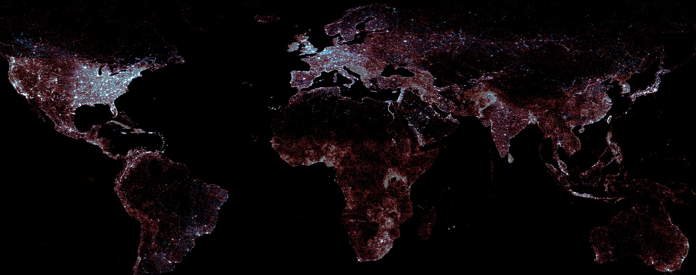
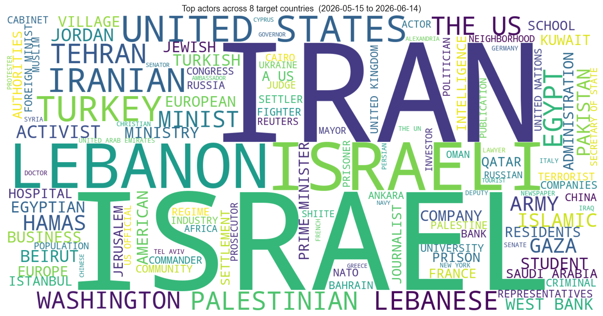
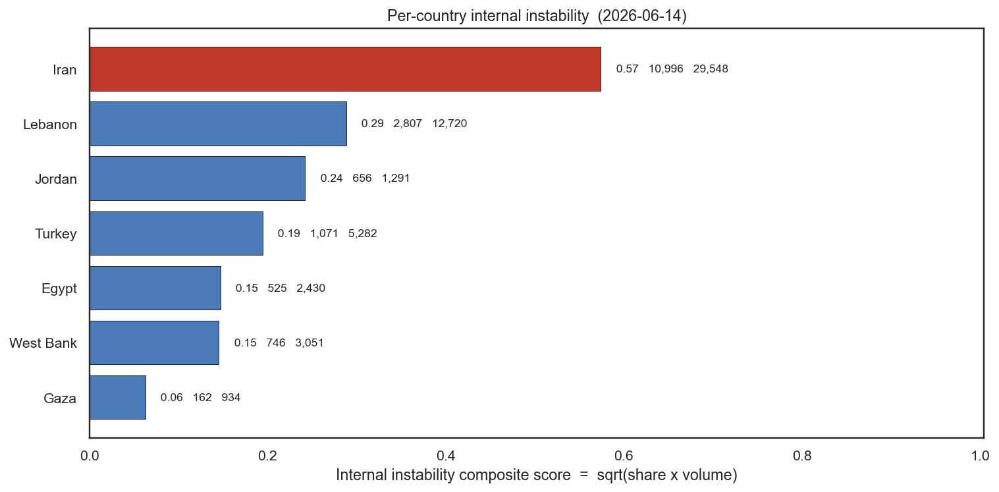
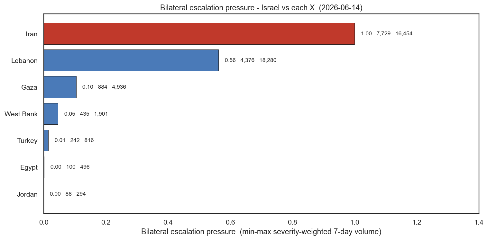
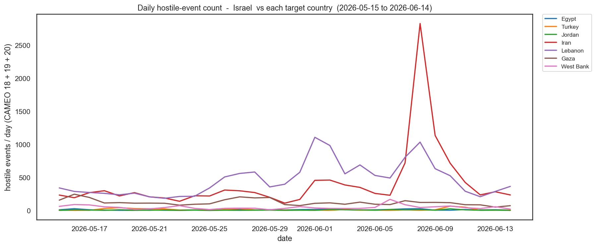
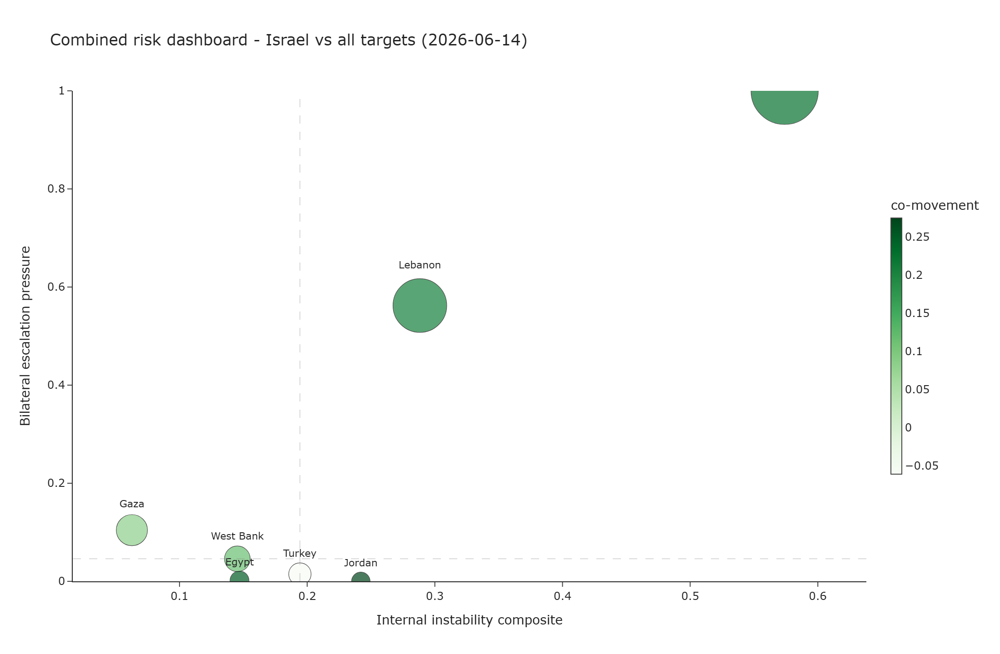
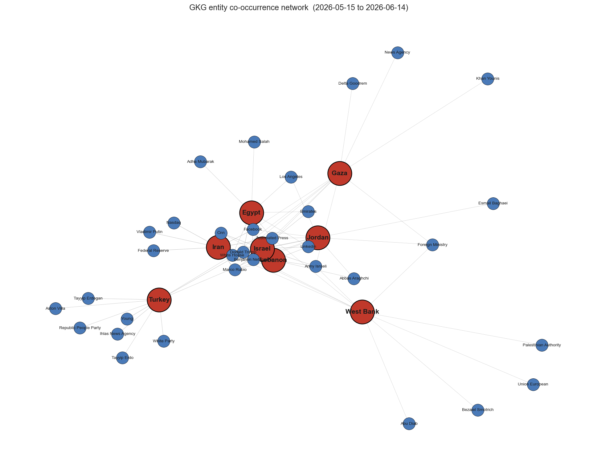

# Conflict Risk Model Based on GDELT OSINT News via Google BigQuery

An open-source intelligence pipeline that quantifies escalation pressure between **Israel** and seven regional entities - **Egypt, Turkey, Jordan, Gaza, West Bank, Iran, Lebanon** - using **GDELT 2.0 Events** and **Global Knowledge Graph** data, queried live from Google BigQuery.

The notebook fetches every signal from `date.today()` backwards. Re-run it on any day of any year - analysis windows update automatically.

<table>
<tr>
<td width="50%" align="center"><b>GDELT Events 2.0</b><br/>
</td>
<td width="50%" align="center"><b>GDELT GKG 2.0</b><br/>
</td>
</tr>
</table>

## What you get

- A **per-country internal-instability composite score** (last 7 days vs last 30 days) for the 7 target countries, with the raw event counts visible in the output table. Israel is the anchor and is excluded from the ranking.
- A **bilateral escalation pressure** score for each `(Israel, X)` dyad - severity-weighted recent volume, min-max scaled across the seven dyads.
- A **Pearson correlation + covariance matrix** between dyads' daily hostile-event time series, plus a side-by-side line chart of those time series.
- An **interactive Plotly dashboard** (hover for full per-dyad details).
- A **GKG entity co-occurrence network** rendered with NetworkX, exposing the named persons and organizations driving each country's news over the last 30 days.
- **Per-country word clouds** - both for general events and specifically for bilateral conflict with Israel.
- **Per-country 7d vs 30d time-series** charts so the reader can see how each country's hostile-event count is evolving.
- 10 **random sample news rows per country** with clickable `SOURCEURL`s so you can audit the data before trusting the analysis.

## What this is not

Not P(war). Not a calibrated probability. Not a real-time decision-grade alert. It is a **media-coverage acceleration index**: a transparent rule-based rank of who is heating up in OSINT news right now. See section 16 of the notebook (Limitations) before drawing any conclusion.

---

## Gallery of the headline charts

These are exported automatically on each run to the `assets/` folder.

### Top actors across the 8 target countries


### Per-country internal instability


### Bilateral escalation pressure - Israel vs each X


### Daily hostile-event count time series


### Combined risk dashboard


### GKG entity co-occurrence network


---

## Files

| File | Purpose |
|---|---|
| `Conflict risk model with GDELT BigQuery.ipynb` | The notebook - no embedded outputs. |
| `NOTEBOOK_GUIDE.md` | Cell-by-cell reference: what each cell does, inputs, outputs, BigQuery scan, runtime. |
| `requirements.txt` | Python dependencies. |
| `.env.example` | Template for `GCP_PROJECT` / `BQ_TOKEN` / `GOOGLE_APPLICATION_CREDENTIALS`. |
| `.gitignore` | Excludes credentials and editor cruft. |
| `assets/` | Section 1 illustrations + the headline charts above, regenerated on every notebook run. |

---

## Prerequisites

1. A **Google Cloud project** with billing enabled and the **BigQuery API** turned on. Note the project ID.
   - Free tier: BigQuery gives 1 TB of query scans per month. A full run of this notebook scans roughly **500 MB – 1.5 GB** depending on the news volume in the window - comfortably inside the free tier.
2. **Python 3.10+** with `pip install -r requirements.txt`.
3. **gcloud CLI** installed: <https://cloud.google.com/sdk/docs/install>. The notebook prompts you for a token produced by `gcloud auth print-access-token`.

---

## Running it

1. In a fresh terminal:
   ```
   gcloud auth login                # one-time, opens a browser
   gcloud auth print-access-token   # prints a ya29... token, lasts ~1 hour
   ```
   Copy the token.
2. Launch Jupyter, open `Conflict risk model with GDELT BigQuery.ipynb`, **Kernel → Restart and Run All**.
3. When prompted, paste your **GCP project ID** and the **access token** from step 1. Both are read with `getpass` (hidden input) and never echoed back.
4. The auth cell runs a free `SELECT 1` smoke test before any real query, so if your token / project ID combination is bad you find out in step 1, not five sections later.

Total wall-clock: **~3-5 minutes** end-to-end. Tokens expire after about an hour - if a later cell raises `RuntimeError("Your BigQuery access token expired…")`, re-run the auth cell with a fresh token.

---

## Methodology

### Countries

```
COUNTRIES = {
  "Israel" (anchor),                                # excluded from ranking
  "Egypt", "Turkey", "Jordan", "Iran", "Lebanon"   # FIPS-only filters
  "Gaza", "West Bank"                              # FIPS=GZ and FIPS=WE; both also use Palestinian CAMEO=PSE
}
```

### Time windows

| Symbol | Definition |
|---|---|
| `TODAY` | `date.today()` |
| `W7_FROM` | `TODAY - 7 days` (the *pulse* window) |
| `W30_FROM` | `TODAY - 30 days` (the *baseline* window) |

No history is fetched. No year is hardcoded anywhere.

### Internal instability (section 8)

For each of the seven target countries, the helper `daily_internal_signals(country, W30_FROM, TODAY)` returns daily counts of:

- CAMEO event roots **14** (Protest), **17** (Coerce), **18** (Assault), **19** (Fight), **20** (Mass violence).
- GKG themes for **water** (`WATER_SECURITY + ENV_WATER`), **electricity / internet outages** (`POWER_OUTAGE + INFRASTRUCTURE_BAD_ROADS + CYBER_ATTACK`), **civil unrest** (`REBELLION + CIVIL_RESISTANCE + PROTEST + GOV_REQUIRES_REFORM`), plus mean **negative tone** from V2Tone.

Composite score:

```
share_score    = ( Σₛ wₛ · events_7d(s) )  /  ( Σₛ wₛ · events_30d(s) + 1 )
volume_score   = ( Σₛ wₛ · events_7d(s) ),  min-max scaled across the 7 countries
internal_score = sqrt( share_score · volume_score )
```

The geometric mean of *"is it accelerating?"* and *"how much absolute hostile coverage is there?"*. High share alone does not earn a top rank if absolute volume is tiny; high volume alone does not earn a top rank if the week is calm by that country's standards. Both `n_7d_events` and `n_30d_events` are shown in the output table so the ranking is fully auditable.

### Bilateral escalation pressure (section 9)

For each `(Israel, X)` pair, the helper `daily_bilateral_signals(target, W30_FROM, TODAY)` returns daily counts of CAMEO **13** (Threaten), **15** (Force posture / drills), **17** (Coerce), **18**, **19**, **20** - for events where one party is Israel (CAMEO `ISR`) and the other is the target country, plus a fallback that captures events where the country code is null but `ActionGeo_CountryCode` and one actor identify the dyad.

Score:

```
raw(X)   = Σₛ wₛ · events_7d(s)
score(X) = ( raw(X) - minₓ raw ) / ( maxₓ raw - minₓ raw )
```

Reads as "where this dyad ranks against the others on absolute weighted hostile coverage this week". Score = 1.0 means the dyad with the most hostile coverage of any dyad; 0.0 means the least.

### Correlation, covariance, and time-series (section 10)

A daily matrix is built (rows = days in the last 30, columns = the 7 dyads) where each cell is the daily count of hostile CAMEO events (`18 + 19 + 20`) for the `(Israel, X)` dyad. From it the notebook computes:

- **Daily hostile-event time series** - one line per dyad, 30 days.
- **Pearson correlation matrix (7 × 7, green palette)** - dyads whose news cycles move together share high off-diagonal values.
- **Covariance matrix (7 × 7, green palette)** - same shape, unstandardised so magnitudes reflect actual event-count variance.
- **Co-movement score** per dyad = mean off-diagonal correlation. The highest is the *canary* whose Israel-bilateral signal is most representative of the regional whole.
- **Top correlated dyad pairs** ranked by `pearson_r`.

### Combined dashboard (section 11)

**Interactive Plotly scatter**: x = internal_score, y = bilateral score, marker size = 7-day hostile event count, marker colour = co-movement score (green palette). Hover any marker to see all the supporting numbers in a tooltip - no label overlap. A static PNG of the dashboard is also written to `assets/` (via kaleido) so it can be embedded above.

### GKG entity co-occurrence network (section 12)

For each country, the notebook pulls the top 10 named entities (V2Persons + V2Organizations) co-mentioned with that country in GKG documents over the last 30 days, then renders the whole thing as a NetworkX graph: countries are red nodes, top entities are blue, edges weighted by co-mention count.

### Per-country word clouds (sections 13, 14)

Two 4×2 grids: section 13 shows the most-amplified actors in *general* events per country; section 14 narrows to the *bilateral* event stream `(Israel ↔ X)` for each target so you see who's involved on the Israel-relationship axis specifically.

### Per-country 7d vs 30d time-series (section 15)

Eight panels - one per country - showing the daily hostile-event count over the last 30 days. The trailing 7-day window is shaded red, and each panel title shows the 7-day total and 30-day total.

---

## Cost expectation

Approximate scans per full run:

| Source | Scan |
|---|---|
| Events EDA (section 4) + word cloud (4.5) | ≈ 50–150 MB |
| GKG EDA (section 5) | ≈ 200–400 MB |
| News samples per country (section 6) | ≈ 30–80 MB |
| Internal signals (section 8) | ≈ 100–300 MB |
| Bilateral signals (section 9) | ≈ 50–150 MB |
| GKG entity fetch (section 12) | ≈ 100–300 MB |
| Per-country word-cloud + bilateral-word-cloud fetches (sections 13, 14) | ≈ 80–200 MB |
| **Total** | **≈ 600 MB – 1.5 GB** |

At the BigQuery on-demand rate of $6.25/TB, that is well under a penny per run.

---

## Limitations and responsible use

- **The headline number is NOT P(war).** It is a media-coverage acceleration index.
- **No training, no calibration.** Weights were chosen by hand.
- **Reporting bias is real.** GDELT is built from worldwide news media. Events outside English / major-language coverage are under-counted.
- **Correlation is not causation.** Acceleration in Israel-vs-X coverage does not prove preparation for war.
- **Bolt-from-the-blue events are invisible** to a 7-day window.
- **Gaza vs West Bank** share Palestinian CAMEO `PSE`. Disambiguation by `ActionGeo_FullName` substring match is imperfect.
- **Do not attribute named individuals.** Actor and GKG entity outputs are aggregate counts.

---

## License

MIT. See `LICENSE` if present; otherwise treat as MIT.

GDELT data is provided by the GDELT Project under its own terms - see [gdeltproject.org](https://www.gdeltproject.org/) for usage and attribution requirements.
